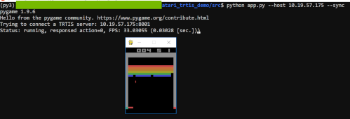

# Atari-TRTIS-Demo

This is an **UNOFFICIAL** project.

The demo application plays an Atari game and the game agent is deployed to a remote server.
Therefore, all inferences to play the game run on the remote server.
This demo mainly depends on the following 3 libraries.

0. [ChainerRL](https://github.com/chainer/chainerrl)
0. [ONNX-Chainer](https://github.com/chainer/onnx-chainer)
0. [TesnorRT Inference Server (TRTIS)](https://github.com/NVIDIA/tensorrt-inference-server)

## Requirement

See `requirements_client.txt` and `requirements_server.txt`.

Also, please install `VcXsrv` and set a `DISPLAY` environment variable like `DISPLAY=localhost:0.0` if you want to run this demo app on Windows.

## Tested environment

* Server
    - Ubuntu 18.04.2 LTS
    - Docker version 18.09.7
    - ChainerRL (to train the model)
        - Base container `chainer/chainer:v6.2.0-python3`
    - ONNX-Chainer
        - Base container `chainer/chainer:v6.2.0-python3`
    - TRTIS
        - Container `nvcr.io/nvidia/tensorrtserver:19.07-py3`
* Client
    - WSL on Windows10(!)
        - This is the reason why `pygame` and etc are used in this project...
    - Python 3.7.3

## How to run

At first, please clone this repo into your workspace.

```shell
$ cd /path/to/host/workspace
$ git clone https://github.com/lazykyama/atari_trtis_demo.git
```

### Training the model

Next, start a docker container to run a ChainerRL training script.

```shell
$ cd /path/to/host/workspace/atari_trtis_demo/
$ sudo docker run --runtime=nvidia --rm -it -v $(pwd):/work chainer/chainer:v6.2.0-python3
```

The ChainerRL training script that we'd like to use in this project is an example DQN script.
So, please...

1. install all dependencies (`OpenCV`, `CuPy`, `Chainer`, `ChainerRL`, `OpenAI gym` and etc),
1. clone ChaninerRL repository,
1. run a DQN training script for reproduction.

```shell
$ cd /opt
$ apt-get update && apt-get install -y wget libgl1-mesa-glx \
  libegl1-mesa libxrandr2 libxrandr2 libxss1 libxcursor1 \
  libxcomposite1 libasound2 libxi6 libxtst6
$ wget https://repo.anaconda.com/archive/Anaconda3-2019.07-Linux-x86_64.sh
$ bash Anaconda3-2019.07-Linux-x86_64.sh
$ eval "$(/root/anaconda3/bin/conda shell.bash hook)"
$ conda init
$ conda create -n py3.6 python=3.6 anaconda
$ conda activate py3.6
$ conda install -c conda-forge opencv
$ pip install cupy-cuda92 chainer chainerrl gym[atari]
$ cd /work
$ git clone https://github.com/chainer/chainerrl.git
$ cd ./chainerrl/examples/atari/reproduction/dqn/
$ python train_dqn.py --gpu 0
```

You can find the trained model at least 1 day after starting to train it.
For example,

```
$ cd /work/chainerrl/examples/atari/reproduction/dqn/
$ ls results/20190826T143334.743497/best/
```

This model is usually well-trained so it can achieve good score in the target game.

### Converting the trained model to ONNX format

After getting the well trained model, start conversion of the model to ONNX format to be deployed to TRTIS.
This conversion script should run in the previous container!

After that, install ONNX-Chainer in the container and run a conversion script.

```shell
$ cd /work/
$ pip install onnx-chainer
$ mkdir basemodel/
$ mkdir onnxmodel/
$ cp /work/chainerrl/examples/atari/reproduction/dqn/results/20190826T143334.743497/best/* ./basemodel/
$ cd /work/onnx_converter_src/
$ python converter.py --model ./basemodel/ --out ./onnxmodel/model.onnx
```

### Deploying the ONNX model and start TRTIS

Finally, try to deploy the converted ONNX model into TRTIS and launch the server process.

Before deploying the model, need to make a configuration file for each model.
The very simple example is like below.

```protobuf
name: "atari"
platform: "onnxruntime_onnx"
input {
    name: "input"
    data_type: TYPE_FP32
    dims: [ 1, 4, 84, 84 ]
}
output {
    name: "action"
    data_type: TYPE_FP32
    dims: [ 1, 4 ]
}
default_model_filename: "model.onnx"
instance_group [
  {
    count: 1
    kind: KIND_GPU
  }
]
```

Also, you need to understand a structure of diretory for deployment.
Please see the details in the [official document - "Model Repository"](https://docs.nvidia.com/deeplearning/sdk/tensorrt-inference-server-guide/docs/model_repository.html).

For this demo, you need make directories and put files into these like below.

```shell
trtismodel/
└── atari
    ├── 1
    │   └── model.onnx
    └── config.pbtxt
```

Once you finish to setup configurations, model files and directories, you can launch the server process.

```shell
$ cd /path/to/host/workspace/  # assuming that trtismodel is workspace in this dir.
$ sudo docker run --runtime=nvidia --rm --shm-size=1g \
    --ulimit memlock=-1 --ulimit stack=67108864 \
    -p8000:8000 -p8001:8001 -p8002:8002 \
    -v $(pwd)/trtismodel/:/models nvcr.io/nvidia/tensorrtserver:19.07-py3 \
    trtserver --model-store=/models
```

When the server successfully load the models, the message below should be shown.

```shell
...(skip)...
I0827 02:51:27.139320 1 model_repository_manager.cc:776] successfully loaded 'atari' version 1
```

If you want to check the server status, you can access Status API via HTTP using the following command.

```shell
$ wget -O - http://${IP}:8000/api/status

...(skip)...

id: "inference:0"
version: "1.4.0"
uptime_ns: 103542947894
model_status {
  key: "atari"
  value {
    config {
      name: "atari"
      platform: "onnxruntime_onnx"
      version_policy {
        latest {
          num_versions: 1
        }
      }
      input {
        name: "input"
        data_type: TYPE_FP32
        dims: 1
        dims: 4
        dims: 84
        dims: 84
      }
      output {
        name: "action"
        data_type: TYPE_FP32
        dims: 1
        dims: 4
      }
      instance_group {
        name: "atari_0"
        count: 1
        gpus: 0
        kind: KIND_GPU
      }
      default_model_filename: "model.onnx"
    }
    version_status {
      key: 1
      value {
        ready_state: MODEL_READY
      }
    }
  }
}
...(skip)...
ready_state: SERVER_READY
-                                 100%[============================================================>]   1.64K  --.-KB/s    in 0s

2019-08-27 11:53:07 (61.5 MB/s) - written to stdout [1677/1677]
```

### Setup a client dependencies

We have only 2 steps to setup the client apps.
First, need to prepare all dependencies for the client.

Please clone this repo in your client machine again and install all dependencies.

```shell
$ pip install atari-py chainerrl grpcio grpcio-tools pygame
$ conda install -c anaconda protobuf
```

After installing the dependencies, generate python codes from TRTIS `prototxt` files.

```shell
$ cd /path/to/client/workspace
$ git clone https://github.com/NVIDIA/tensorrt-inference-server.git
$ cd tensorrt-inference-server/
$ git checkout -b r19.07 origin/r19.07
$ cd ../
$ git clone https://github.com/lazykyama/atari_trtis_demo.git
$ cd atari_trtis_demo/src/
$ protoc --proto_path=../../tensorrt-inference-server/src/core/ --python_out=./ \
    api.proto
$ protoc --proto_path=../../tensorrt-inference-server/src/core/ --python_out=./ \
    grpc_service.proto
$ protoc --proto_path=../../tensorrt-inference-server/src/core/ --python_out=./ \
    model_config.proto
$ protoc --proto_path=../../tensorrt-inference-server/src/core/ --python_out=./ \
    request_status.proto
$ protoc --proto_path=../../tensorrt-inference-server/src/core/ --python_out=./ \
    server_status.proto
$ python -m grpc_tools.protoc --proto_path=../../tensorrt-inference-server/src/core/ \
    --grpc_python_out=./ ../../tensorrt-inference-server/src/core/grpc_service.proto
```

After that, you can find six `*_pb2.py` files in the `src` directory.

### Playing a game!

Thank you for the waiting!
You can play the Atari game by the RL agent deployed on the remote server.

```shell
$ python app.py --host ${TRTIS_IP} --sync
```

The following image is an example of running application.

[](./docs/imgs/app_running.png)

`--sync` option means that this application sends all requests to the server and waits for all responses.
So, if the network latency is long, sometimes, the rendering might be blocked.
At the test, if the latency is around 10-20 msec., the rendering is almost smooth.

If you don't set `--sync` option, the application sends requests asynchronously.
Therefore, in this setting, the score should be decreased because of delayed response.

### To run a standalone version for debug and etc

The scripts for standalone version are in the directory, `standalone_src/`.
You can execute this application by following the steps below.

```shell
$ cd /path/to/client/workspace/atari_trtis_demo/standalone_src/
$ mkdir ./model/
$ scp ${SERVER}:/path/to/host/workspace/atari_trtis_demo/chainerrl/examples/atari/reproduction/dqn/results/20190826T143334.743497/best/* ./model/
$ python app.py --modelpath ./model/
```
